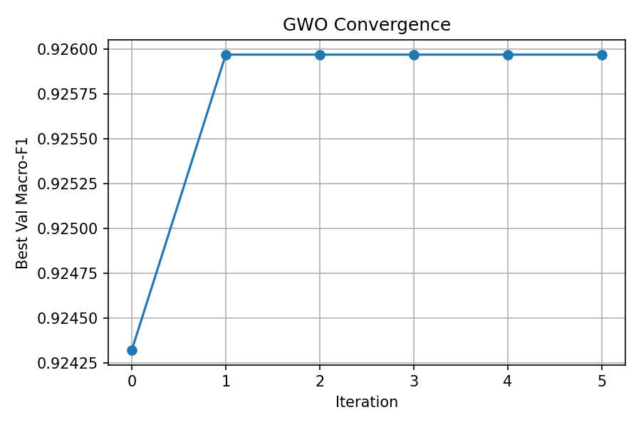
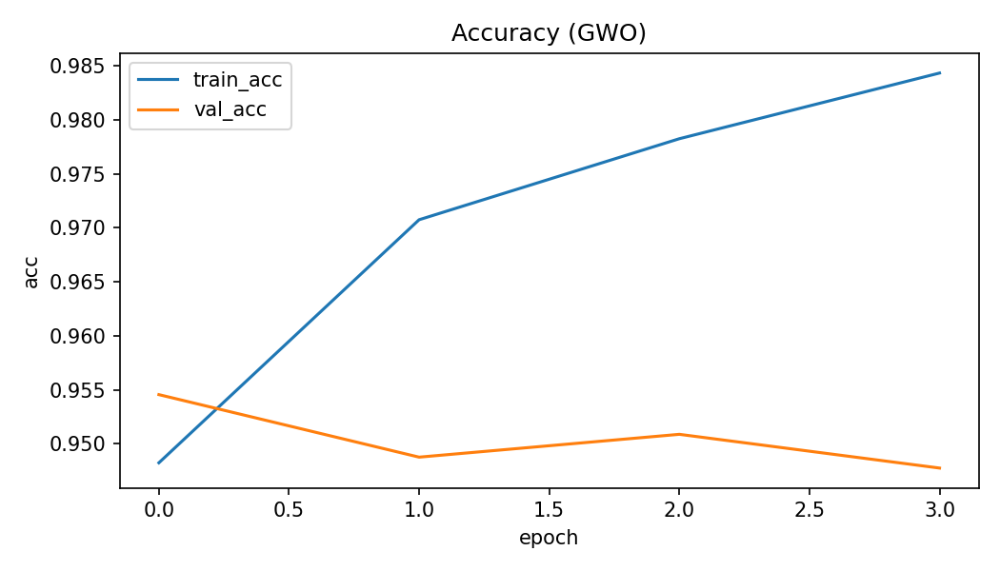
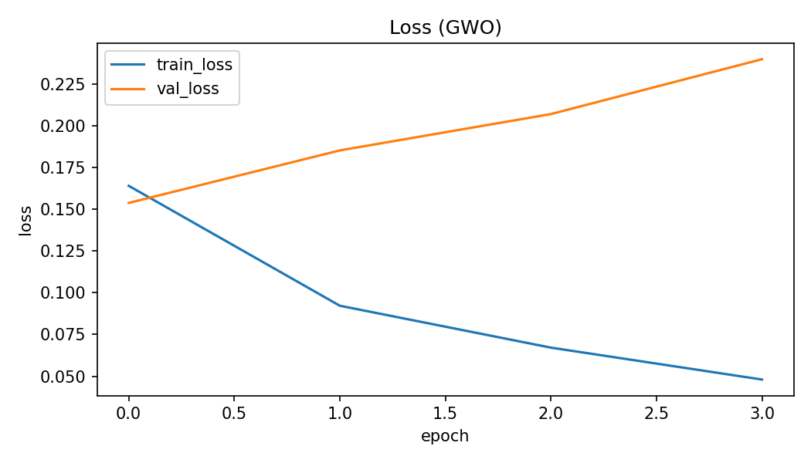
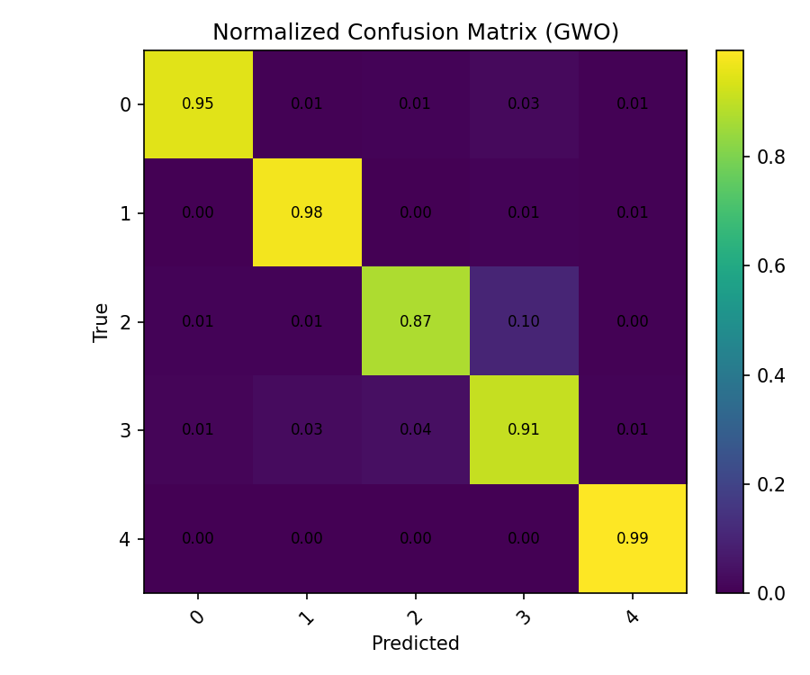
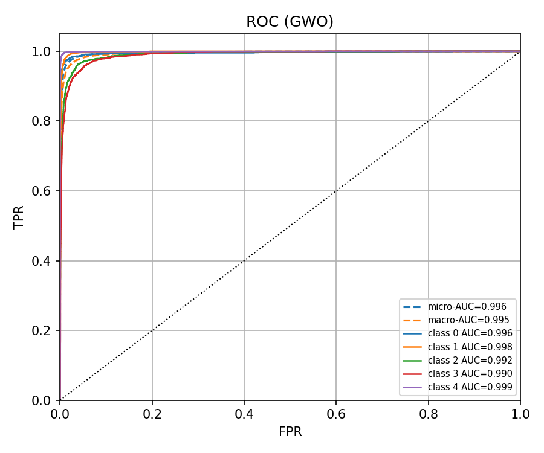
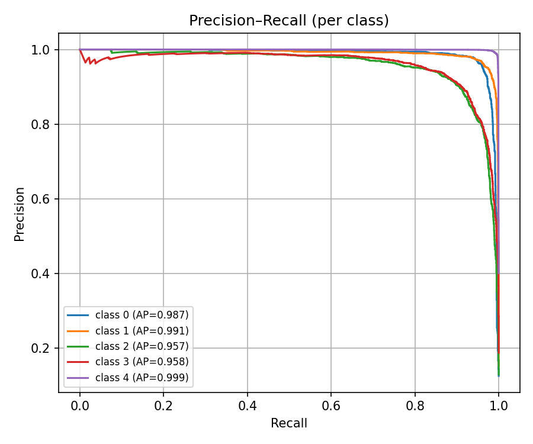
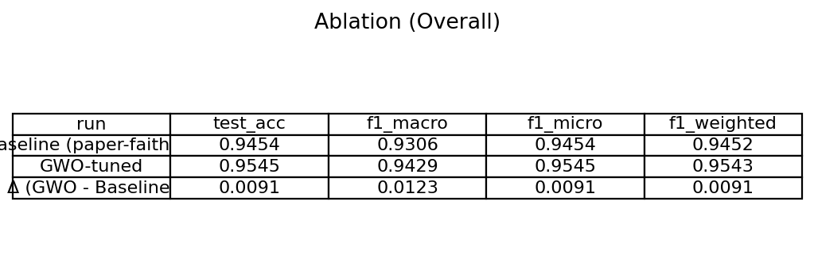
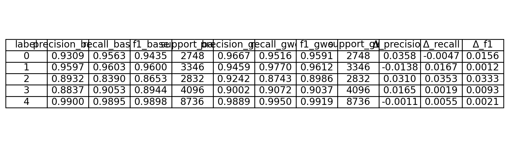
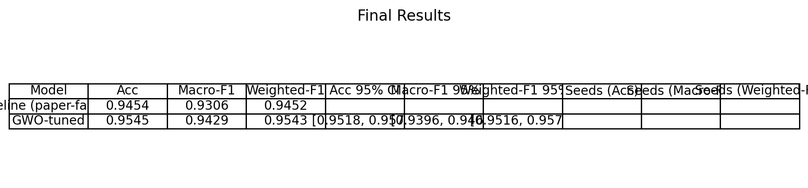

# Hybrid-ABTM-GWO-Optimization

Grey Wolf Optimizer–based hyperparameter tuning for the Attention-Based Text Model (ABTM).

# ABTM-Light with Grey Wolf Optimizer (GWO)

This repository presents an enhanced implementation of the **ABTM (Attention-Based Text Model)** by integrating the **Grey Wolf Optimizer (GWO)** for adaptive hyperparameter tuning.  
The proposed GWO-tuned model achieves improved classification accuracy and F1 performance compared to the baseline ABTM configuration.  
All experiments, figures, and ablation results are included for full reproducibility.

---

## Overview

- **Baseline model:** ABTM (paper-faithful configuration)
- **Proposed method:** ABTM-Light + Grey Wolf Optimizer (GWO)
- **Goal:** To optimize learning rate, dropout rate, and dense units using GWO and improve overall classification metrics.
- **Dataset:** Multi-class text classification dataset (5 classes)
- **Frameworks:** TensorFlow / Keras, Scikit-learn, NumPy, Pandas, Matplotlib

---

## Methodology

The **Grey Wolf Optimizer (GWO)** was used to automatically tune hyperparameters of the ABTM-Light model.  
GWO mimics the leadership hierarchy and hunting strategy of grey wolves in nature.  
Each wolf represents a set of model hyperparameters, and the algorithm iteratively minimizes the validation loss.

Optimized parameters include:

- Learning Rate (`lr`)
- Dropout Rate (`dropout`)
- Dense Layer Units (`dense_units`)

The final GWO configuration converged after 5 iterations, achieving stable macro-F1 performance.

---

## Results Summary

### 1. Overall Performance

| Model                     |    Acc     |  Macro-F1  | Weighted-F1 |
| :------------------------ | :--------: | :--------: | :---------: |
| Baseline (paper-faithful) |   0.9454   |   0.9306   |   0.9452    |
| **GWO-tuned**             | **0.9545** | **0.9429** | **0.9543**  |

- Δ (GWO - Baseline): +0.0091 Acc / +0.0123 Macro-F1 / +0.0091 Weighted-F1
- All values computed with 95% bootstrap confidence intervals.

---

### 2. Per-Class Metrics

| Label | Precision | Recall |   F1   | Support |
| :---- | :-------: | :----: | :----: | :-----: |
| 0     |  0.9667   | 0.9516 | 0.9591 |  2748   |
| 1     |  0.9459   | 0.9770 | 0.9612 |  3346   |
| 2     |  0.9242   | 0.8743 | 0.8986 |  2832   |
| 3     |  0.9002   | 0.9072 | 0.9037 |  4096   |
| 4     |  0.9889   | 0.9950 | 0.9919 |  8736   |

---

## Visual Results

| Figure                                                                               | Description                                      |
| :----------------------------------------------------------------------------------- | :----------------------------------------------- |
|                                     | GWO convergence curve (best validation Macro-F1) |
|                       | Training vs Validation Accuracy                  |
|                          | Training vs Validation Loss                      |
|  | Normalized confusion matrix                      |
|                            | ROC curves (per class, micro/macro AUC)          |
|  | Precision-Recall curves per class                |
|              | Ablation study summary table                     |
|  | Per-class ablation comparison                    |
|            | Final results table                              |

---

## Configuration

| Setting       | Description                             |
| :------------ | :-------------------------------------- |
| Optimizer     | Grey Wolf Optimizer (GWO)               |
| Model         | ABTM-Light (BERT + TF-IDF + BoW fusion) |
| Epochs        | 3                                       |
| Batch size    | 32                                      |
| Tokenizer     | BERT WordPiece                          |
| Loss Function | Categorical Crossentropy                |
| Metrics       | Accuracy, Macro-F1, Weighted-F1         |
| Bootstraps    | 300 (95% CI)                            |

---

## Ablation Study

A comparative analysis was performed to assess the impact of GWO tuning on model performance.

| Run                       |  Test Acc   |  Macro-F1   |  Micro-F1   | Weighted-F1 |
| :------------------------ | :---------: | :---------: | :---------: | :---------: |
| Baseline (paper-faithful) |   0.9454    |   0.9306    |   0.9454    |   0.9452    |
| **GWO-tuned**             | **0.9545**  | **0.9429**  | **0.9545**  | **0.9543**  |
| Δ (GWO - Baseline)        | **+0.0091** | **+0.0123** | **+0.0091** | **+0.0091** |

---
